# Prepare your development environment
Before you get start, please make sure your laptop is ready for the workshop. Typically, you'll need those applications:

- Text editor (heavily personal preference, for example VSCode, Atom, etc.)
- Web Browser (Chrome, Safari, Firefox, etc.)
- Terminal
- Docker
- Git


# 1. Getting Started

To make things easier for you to setup the development environment, we already prepare a developmet kit, and all the following commands are based on this template. If you want to setup the development environment by yourself from scratch, read the Go Extra Miles sections. You'll need to make a copy of this kit in your computer,

- Open the terminal in your computer
- Run this command in your terminal:

```bash
git clone git@github.com:nguyenquangminh0711/rails-girl-demo.git
```

- Change the working directory to the kit:

```bash
cd rails-girl-demo
```

- Start the web server with this command:

+ On Windows

```bash
./start_server.bat
```

+ On Linux/MacOS

```bash
./start_server.sh
```

- The web server is started at [http://localhost:4000](http://localhost:4000). Open this link, and if you can see this, congratulation, you started your first web server.

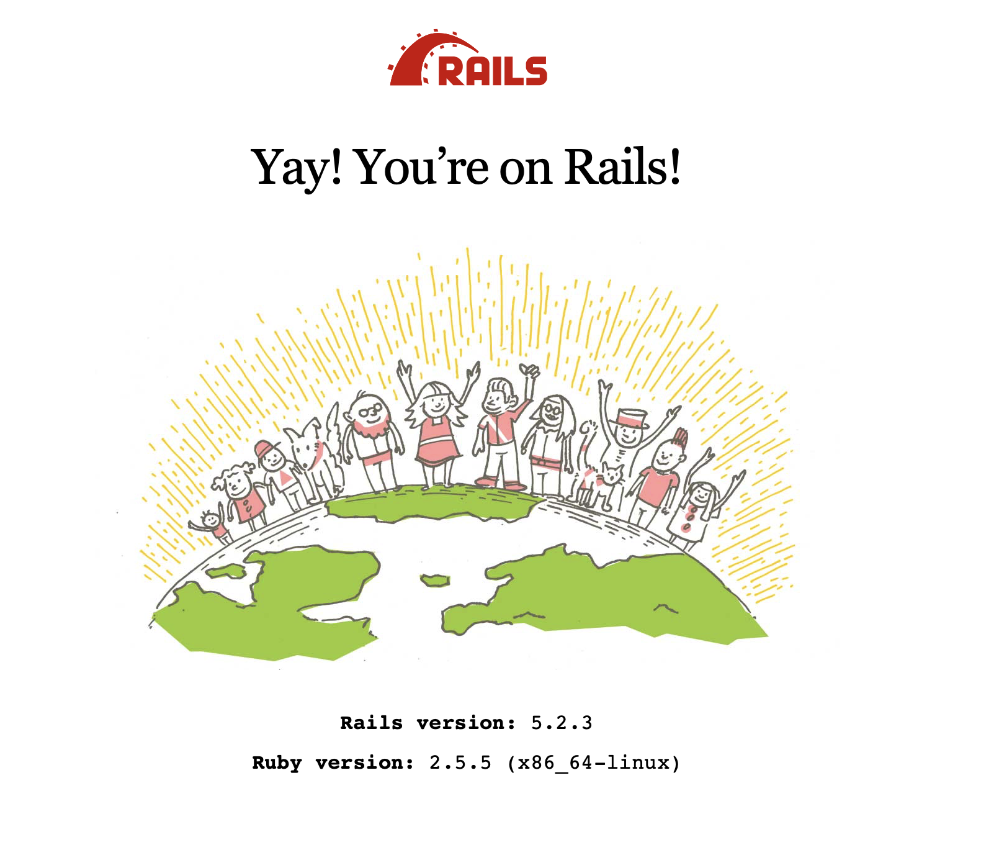

- To stop the web server, in your recent terminal window, press `Ctrl` and `C`.


# 2. Create a static product listing page

In this section, you'll be able to create a page to show a list of products. A typical product shown on the home page needs some information:

- Name, for example "iPhone XS Max 64GB"
- Brand, for example "Apple"
- Price, for example, "29,000,000"
- Product image, for example: [iPhone XS Max image from FPT Shop](https://cdn.fptshop.com.vn/Uploads/Originals/2018/10/11/636748771945393060_iPhone-Xs-Max-gold.png)

Let's create the first page to show the above product.

- Start another terminal window
- Run this command

+ On Windows

```bash
./start_console.bat
```

+ On Linux/MacOS

```bash
./start_console.sh
```

- Run this command:

```bash
rails generate controller Products index show
```

You are using the scaffolding feature of Rails. If everything is correct, you'll see something like this:

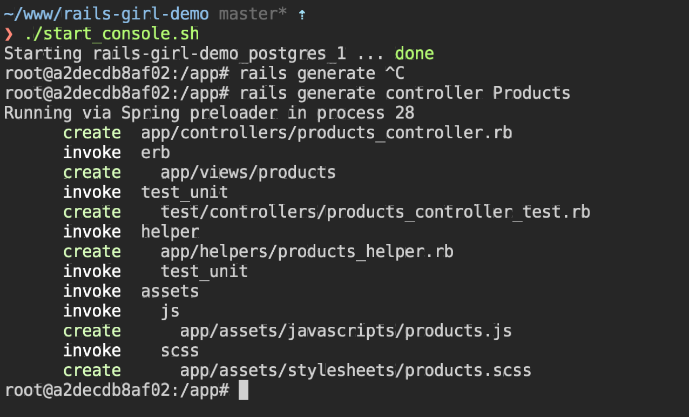

- Now, open the file `app/controllers/products_controller.rb`, you'll see something like this:

```ruby
class ProductsController < ApplicationController
  def index
  end
end
```

- Let's add the list of products you want to display to the `index` method of class `ProductsController`. You can add as many products you want. You can copy the image links from Google Images:

```ruby
class ProductsController < ApplicationController
  def index
    @products = [
      {
        name: 'Điện thoại iPhone XS Max 512GB',
        brand: 'Apple',
        price: 29000000,
        image: 'https://cdn.fptshop.com.vn/Uploads/Originals/2018/10/11/636748771945393060_iPhone-Xs-Max-gold.png'
      },
      {
        name: 'Tai nghe Bluetooth Airpod 2',
        brand: 'Apple',
        price: 4500000,
        image: 'https://store.storeimages.cdn-apple.com/4982/as-images.apple.com/is/image/AppleInc/aos/published/images/M/RX/MRXJ2/MRXJ2?wid=1144&hei=1144&fmt=jpeg&qlt=95&op_usm=0.5,0.5&.v=1551489675083'
      },
      {
        name: 'Điện Thoại Samsung Galaxy S10',
        brand: 'Samsung',
        price: 16000000,
        image: 'https://cdn.fptshop.com.vn/Uploads/Originals/2019/2/21/636863643187455627_ss-galaxy-s10-trang-1.png'
      },
      {
        name: 'Tai nghe Beat Studio M8',
        brand: 'Apple',
        price: 7000000,
        image: 'https://ngheloa.com/wp-content/uploads/2017/12/headphone-beat-studio-ms-81118-chinh-hang-ngheloa.com-1.jpg'
      },
      {
        name: 'Máy tính bảng iPad Pro 11 inch Wifi 64GB',
        brand: 'Apple',
        price: 20000000,
        image: 'https://cdn.tgdd.vn/Products/Images/522/195067/ipad-pro-11-inch-2018-64gb-wifi-33397-thumb-600x600.jpg'
      },
    ]
  end
end
```

Let's add a list of 5 items. Please note that all items in the product list must have 4 fields: `name`, `brand`, `brand`, `price`.

- Edit the file `app/views/products/index.html.erb`. Replace the content with the follow scripts:

```erb
<% @products.each do |product| %>
  <%= render 'product', product: product %>
<% end %>
```

- Create new file `app/views/products/_product.html.erb`, with the following content:

```erb
<div class="product">
  <p>
    "/>
  </p>
  <b><%= product[:name] %></b>
  <p><%= product[:brand] %></p>
  <i><%= number_to_currency(product[:price], unit: 'đ', seperator: ',') %></i>
</div>
```

- To make the product listing page your home page, replace the content in `config/routes.rb` with:

```ruby
Rails.application.routes.draw do
  root 'products#index'
end
```

- Open [http://localhost:4000](http://localhost:4000). Tada, you have your first basic product page.


- It doesn't look great right? Let's add some styling to this page to make it more attractive. We'll use [Bootstrap 4](https://getbootstrap.com), which is the most popular front-end framework. The library is already bundled in the development kit. You'll just need to modify and apply the HTML components into the product page.

- Update the file `app/views/products/index.html.erb` with:

```erb
<div class="products container">
  <div class="row">
    <% @products.each do |product| %>
      <%= render 'product', product: product %>
    <% end %>
  </div>
</div>
```

- Update the file `app/views/products/_product.html.erb` with:

```erb
<div class="product col-md-4 mb-3">
  <p>
    "/>
  </p>
  <div class="product-brand mb-1"><%= product[:brand] %></div>
  <h5 class="product-name"><%= product[:name] %></h5>
  <h5 class="product-price"><%= number_to_currency(product[:price], unit: 'đ', seperator: ',', format: "%n %u") %></h5>
</div>
```

- Update the file `app/assets/stylesheets/products.scss` with:

```css
.product-name {
  color: #222;
}

.product-name a {
  color: #222;
}

.product-brand {
  color: #777;
}

.product-price {
  color: green;
}
```

- Refresh your website, you'll see something like this. Not bad huh?


# 3. Use database to manage your products

When the number of products grows, it's terrible to keep adding the products to the `ProductsController`. Let's use the database to store and manage your products.

- Generate models and schema migration with this command:

```bash
rails generate model Product name:text brand:text price:integer image:text
```

- Make the database schema change take effective with this command:

```bash
rake db:migrate
```

- We'll need some validations for the Product model to ensure the validity of data. Edit the file `app/models/product.rb`

```ruby
class Product < ApplicationRecord
  validates :name, presence: true, length: {in: 5..255}
  validates :brand, presence: true, length: {in: 5..100}
  validates :price, inclusion: 1..1000000000
  validates  :image, presence: true
end
```

- You'll need a list of seed products for your website. Copy the product list in `ProductsController`, and convert into following in the file `db/seeds.rb`

```ruby
Product.destroy_all
Product.create(
  name: 'Điện thoại iPhone XS Max 512GB',
  brand: 'Apple',
  price: 29000000,
  image: 'https://cdn.fptshop.com.vn/Uploads/Originals/2018/10/11/636748771945393060_iPhone-Xs-Max-gold.png'
)
Product.create!(
  name: 'Tai nghe Bluetooth Airpod 2',
  brand: 'Apple',
  price: 4500000,
  image: 'https://store.storeimages.cdn-apple.com/4982/as-images.apple.com/is/image/AppleInc/aos/published/images/M/RX/MRXJ2/MRXJ2?wid=1144&hei=1144&fmt=jpeg&qlt=95&op_usm=0.5,0.5&.v=1551489675083'
)
Product.create!(
  name: 'Điện Thoại Samsung Galaxy S10',
  brand: 'Samsung',
  price: 16000000,
  image: 'https://cdn.fptshop.com.vn/Uploads/Originals/2019/2/21/636863643187455627_ss-galaxy-s10-trang-1.png'
)
Product.create!(
  name: 'Tai nghe Beat Studio M8',
  brand: 'Apple',
  price: 7000000,
  image: 'https://ngheloa.com/wp-content/uploads/2017/12/headphone-beat-studio-ms-81118-chinh-hang-ngheloa.com-1.jpg'
)
Product.create!(
  name: 'Máy tính bảng iPad Pro 11 inch Wifi 64GB',
  brand: 'Apple',
  price: 20000000,
  image: 'https://cdn.tgdd.vn/Products/Images/522/195067/ipad-pro-11-inch-2018-64gb-wifi-33397-thumb-600x600.jpg'
)
```

- Run this script to seed the product list into database:

```ruby
rake db:seed
```

- Update the file `app/controllers/products_controller.rb`, with:

```ruby
class ProductsController < ApplicationController
  def index
    @products = Product.all
  end
end
```

- Replace the hash access syntax to method calls in `app/views/products/_product.html.erb` with:

```ruby
<div class="product col-md-4 mb-3">
  <p>
    "/>
  </p>
  <div class="d-flex justify-content-between">
    <div class="product-brand mb-1"><%= product.brand %></div>
    <div class="product-id mb-1">#<%= product.id %></div>
  </div>
  <h5 class="product-name"><%= product.name %></h5>
  <h5 class="product-price"><%= number_to_currency(product.price, unit: 'đ', seperator: ',', format: "%n %u") %></h5>
</div>
```

- The number next to the brand is the product ID. Add some CSS styles to de-emphasize the product ID. Add to the file `app/assets/stylesheets/products.scss`:

```css
.product-id {
  color: #777;
}
```

- Now, open Rails console with the command:

```bash
rails c
```

- You can freely create a new product by copy & paste the commands into Rails console:

```ruby
Product.create!(
  name: 'name',
  brand: 'brand',
  price: 1000,
  image: 'image_url'
)
```

- You can also update a particular product information (for example ID 4), with the following commands in Rails console:

```ruby
product = Product.find(4)
product.update!(price: 8000000)
```

- And finally, you can delete a particular product (for example ID 3), with the following commands in Rials console:

```ruby
product = Product.find(3)
product.destroy!
```


# 4. Build the product detail page

- Add the routing information of the products to `config/routes.rb`:

```ruby
resources :products, only: [:index, :show]
```

- Create a top navigation bar. Update the file `app/views/layouts/application.html.erb` with:

```erb
<!DOCTYPE html>
<html>
  <head>
    <meta charset="utf-8">
    <meta name="viewport" content="width=device-width">
    <title>Rails Girl Shop</title>
    <%= csrf_meta_tags %>
    <%= csp_meta_tag %>

    <%= stylesheet_link_tag    'application', media: 'all' %>
    <%= javascript_include_tag 'application' %>
  </head>

  <body>
    <nav class="navbar navbar-light bg-light navbar-expand-md">
      <div class="navbar-header">
        <a class="navbar-brand" href="<%= root_path %>">
          Rails Girl Shop
        </a>
      </div>
      <div class="navbar-collapse collapse">
        <ul class="nav navbar-nav ml-auto">
          <li class="nav-item">
            <a class="nav-link" href="<%= root_path %>">Products</a>
          </li>
        </ul>
      </div>
    </nav>
    <main class="pt-3 container">
      <%= yield %>
    </main>
  </body>
</html>
```

- To view the list of available routes, use

```bash
rake routes
```

- Add the product link, edit the file `app/views/products/_product.html.erb`:


```erb
<div class="product col-md-4 mb-3">
  <a href="<%= product_path(product) %>">
    <p>
    "/>
    </p>
  </a>
  <div class="d-flex justify-content-between">
    <div class="product-brand mb-1"><%= product.brand %></div>
    <div class="product-id mb-1">#<%= product.id %></div>
  </div>

  <h5 class="product-name"><a href="<%= product_path(product) %>"><%= product.name %></a></h5>
  <h5 class="product-price"><%= number_to_currency(product.price, unit: 'đ', seperator: ',', format: "%n %u") %></h5>
</div>
```

- Add the `show` method into `ProductsController` at `app/controllers/products_controller.rb`

```ruby
  def show
    @product = Product.find(params[:id])
  end
```

- Create the product detail page, edit `app/views/products/show.html.erb`

```ruby
<div class="product-detail container d-flex justify-content-around">
  "/>
  <div class="product-detail-info ml-3">
    <div class="d-flex justify-content-between">
      <div class="product-brand mb-1"><%= @product.brand %></div>
      <div class="product-id mb-1">#<%= @product.id %></div>
    </div>

    <h4 class="product-name"><a href="<%= product_path(@product) %>"><%= @product.name %></a></h5>
    <h5 class="product-price"><%= number_to_currency(@product.price, unit: 'đ', seperator: ',', format: "%n %u") %></h5>
  </div>
</div>
```

- Add some styles into `app/assets/stylesheets/products.scss`:

```css
.product-detail .product-detail-info {
  flex: 0 0 300px;
}
```

- The product detail page needs some more information. Let's add one more field into product, called description.

```bash
rails generate migration add_description_to_products description:text
```

- Run command to make database migration effective:

```bash
rake db:migrate
```

- Add product description for a product (for example, ID 3) with Rails console. Or you can update the seed file and re-seed again.

```ruby
product = Product.find(3)
product.update!(description: "- An immersive Cinematic Infinity Display, Pro-grade Camera and Wireless PowerShare The next generation is here

- Ultrasonic in-display fingerprint ID protects and unlocks with the first touch

- Pro-grade Camera effortlessly captures epic, pro-quality images of the world as you see it

- Intelligently accesses power by learning how and when you use your phone
")
```

- Add product description section to the file `app/views/products/show.html.erb`

```erb
<p class="product-description"><%= simple_format(@product.description) %></p>
```

- Add some more styling to the CSS file:

```css
.product-detail .product-description {
  padding-top: 15px;
  margin-top: 15px;
  border-top: 1px #ddd solid;
}
```

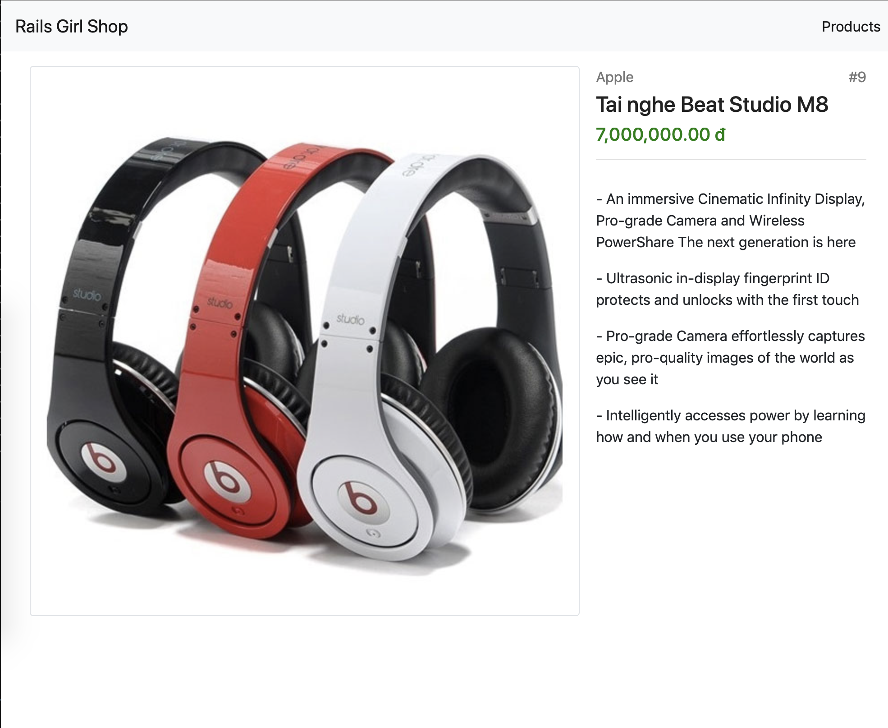


# 5. Deploy your application (Advanced)
To deploy to the world, please follow the following step:

- Install Heroku CLI at [https://devcenter.heroku.com/articles/heroku-cli](https://devcenter.heroku.com/articles/heroku-cli)

- Register an account in Heroku


- Create your first app (ex: 'rails-girl-demo') in Heroku console

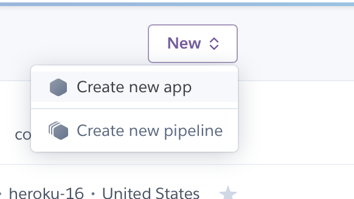
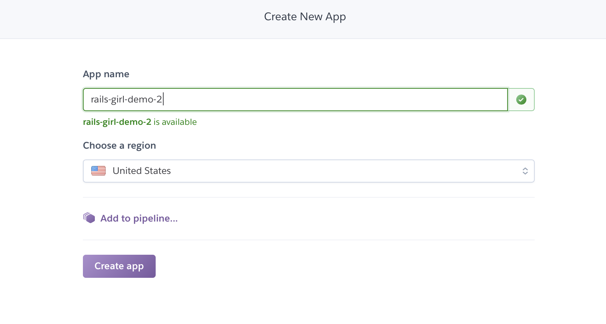

- Add Postgres Plugin

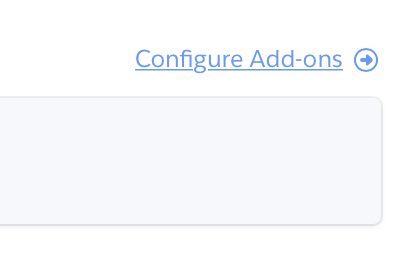
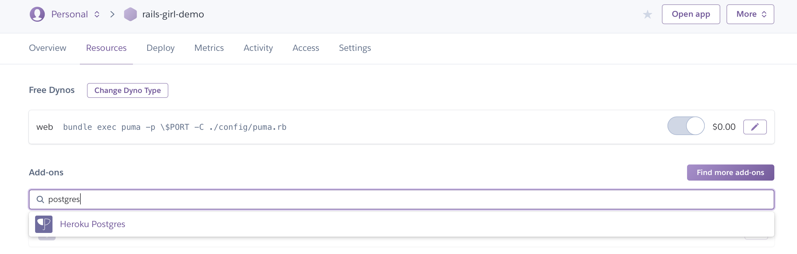
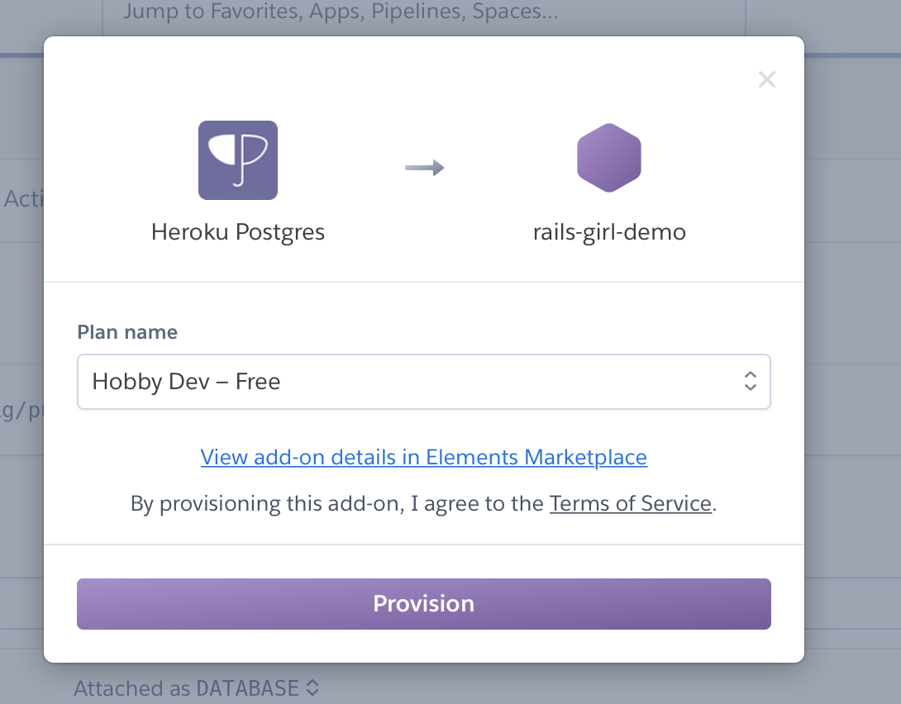
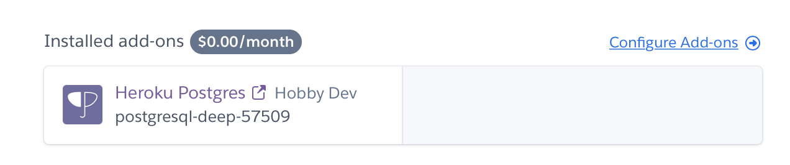

- Run `heroku login`
- Run `heroku container:login`
- Run `heroku container:push web --app <<APP NAME>>`
- Run `heroku container:release web --app <<APP NAME>>`

Click on "Open app", and enjoy

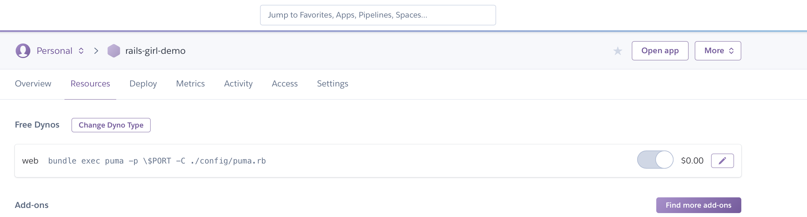

To re-deploy, please follow the following step:
- Run `heroku container:push web --app <<APP NAME>>`
- Run `heroku container:release web --app <<APP NAME>>`


# 6. Build admin product management page (Advanced)

In this section, you'll implement an admin page to manage the products displayed in the product page. The management page stays at a subpath of the website ([http://localhost:4000/admin](http://localhost:4000/admin)), and acts as a isolated module of the website. The functionalities include:

- List of all products in the system
- Create new product
- Edit a product
- Delete a product
- Validate the product information and display errors if any.

At the first look, it looks like there are a lot of things to do, at least tripple what we already did right? Not at all, Ruby on Rails is famous of the ability to generate everything you need with one command, called `scaffold`.

- Run the following command in the console:

```bash
rails generate scaffold_controller admin/products --model-name Product
```

- You'll all the things we need (controllers, views, etc.) are generated. You should discover the contents in those files by yourself to know what the scaffold provides you.

- Add the routing configuration for admin page to `config/routes.rb`:

```ruby
namespace :admin do
  root 'products#index'
  resources :products, only: [:new, :create, :index, :edit, :update, :destroy]
end
```

- You can now access the admin page via [http://localhost:4000/admin](http://localhost:4000/admin). There isn't much content inside.

- Let's the menu item in the navigation bar on the top to access the admin page quickly. Add the following content into `app/views/layouts/application.html.erb`:

```erb
<li class="nav-item">
  <a class="nav-link" href="<%= admin_root_path %>">Admin</a>
</li>
```

- Replace the content in `app/views/admin/products/index.html.erb` with:

```erb
<div class="container">
  <%= link_to 'New product', new_admin_product_path, class: 'btn btn-success mb-3'%>
  <table class="table">
    <thead>
      <tr>
        <th scope="col">#</th>
        <th scope="col">Image</th>
        <th scope="col">Brand</th>
        <th scope="col">Product name</th>
        <th scope="col">Produce description</th>
        <th scope="col">Price</th>
        <th scope="col"></th>
      </tr>
    </thead>
    <tbody>
      <% @products.each do |product| %>
        <%= render 'product_row', product: product %>
      <% end %>
    </tbody>
  </table>
  <%= link_to 'New product', new_admin_product_path, class: 'btn btn-success mt-3'%>
</div>
```

- Create a new file `app/views/admin/products/_product_row.html.erb` with the content:

```erb
<tr>
  <td class="align-middle"><%= product.id %></td>
  <td class="align-middle">"/></td>
  <td class="align-middle"><%= product.brand %></td>
  <td class="align-middle"><%= product.name %></td>
  <td class="align-middle"><%= number_to_currency(product.price, unit: 'đ', seperator: ',', format: "%n %u") %></td>
  <td class="align-middle">
    <%= link_to 'Edit', edit_admin_product_path(product), class: "btn btn-primary" %>
    <%= link_to 'Show', product_path(product), class: "btn btn-secondary", target: '_blank' %>
    <%= link_to 'Delete', admin_product_path(product), method: :delete, data: {confirm: "Are you sure?"}, class: 'btn btn-danger' %>
  </td>
</tr>
```

- Now access the admin page again, you'll see the list of products there.

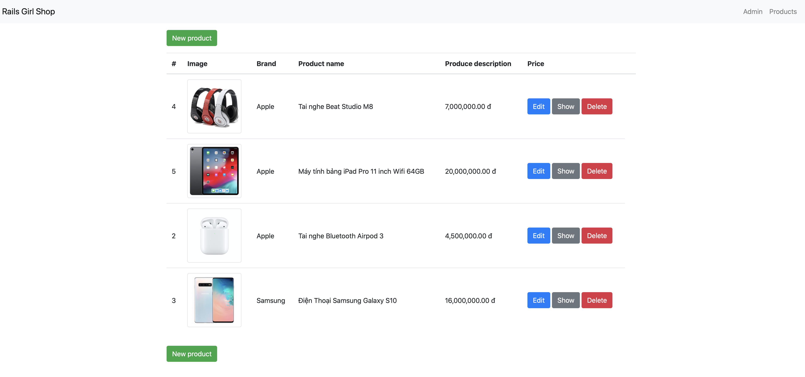

- To make the product images smaller and fit into the table, add to `app/assets/stylesheets/admin/products.scss`:

```css
.admin-product-image {
  max-width: 128px;
}
```

- Let's continue to implement the product edit and new page.

- Replace the content in `app/views/admin/products/edit.html.erb` with:

```
<div class="container">
  <%= link_to '<< Back', admin_products_path %>
  <%= render 'form', product: @product %>
</div>
```

- Replace the content in `app/views/admin/products/new.html.erb` with:

```erb
<div class="container">
  <%= link_to '<< Back', admin_products_path %>
  <%= render 'form', product: @product %>
</div>
```

- Create new file `app/views/admin/products/_form.html.erb` with following content:

```erb
<%= form_with(model: [:admin, product], local: true) do |form| %>
  <div class="mt-3 mb-3">
    <div class="form-group">
      <label for="product_brand">Brand</label>
      <%= form.text_field(:brand, class: 'form-control') %>
    </div>

    <div class="form-group">
      <label for="product_image">Product image</label>
      <%= form.text_field(:image, class: 'form-control') %>
    </div>

    <div class="form-group">
      <label for="product_name">Name</label>
      <%= form.text_field(:name, class: 'form-control') %>
    </div>

    <div class="form-group">
      <label for="product_description">Description</label>
      <%= form.text_area(:description, class: 'form-control', rows: 7) %>
    </div>

    <div class="form-group">
      <label for="product_price">Price</label>
      <%= form.number_field(:price, class: 'form-control') %>
    </div>
  </div>

  <% if product.errors.any? %>
    <div class="card bg-warning">
      <div class="card-body">
        <ul>
        <% product.errors.full_messages.each do |message| %>
          <li><%= message %></li>
        <% end %>
        </ul>
      </div>
    </div>
  <% end %>

  <div class="actions d-flex justify-content-center mt-3">
    <%= form.submit(class: 'btn btn-primary') %>
  </div>
<% end %>
```

- Edit the `product_params` method in `app/controllers/admin/products_controller.rb` with:

```ruby
def product_params
  params.fetch(:product).permit(:brand, :image, :name, :description, :price)
end
```

- Find and replace the following content in `app/controllers/admin/products_controller.rb`:

  + From `redirect_to @product, notice: 'Product was successfully created.'` to `redirect_to edit_admin_product_path(@product), notice: 'Product was successfully created.'`

  + From `redirect_to @product, notice: 'Product was successfully updated.'` to `redirect_to edit_admin_product_path(@product), notice: 'Product was successfully updated.'`

- Add those lines into `app/views/layouts/application.html.erb`, before the body closing tag

```erb
<% if notice || alert %>
  <div class="fixed-bottom container mb-3">
    <% if notice %>
      <div class="card bg-success">
        <div class="card-body">
          <%= notice %>
        </div>
      </div>
    <% end %>

    <% if alert %>
      <div class="card bg-danger">
        <div class="card-body">
          <%= alert %>
        </div>
      </div>
    <% end %>
  </div>
<% end %>
```

- Refresh the admin management page, and tada, you a complete admin management page.

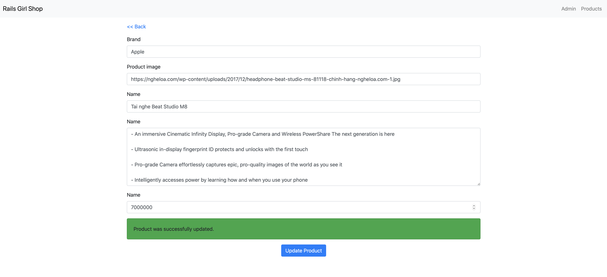

# 7. Add authentication feature (Advanced)

After you finish all the above sections, you may ask yourself a question "Wait, so everyone accessing my website can edit the product?". That would be a huge risk of security. Next, what would happen when a user want to buy a product? How can we differentiate the users in the website? To support all of those, we need to add a user system and corresponding authentication system. Don't be worried, Ruby on Rails ecosystem supports those fancy things out of the box. We'll use [Devise](https://github.com/plataformatec/devise), which is the most popular authentication solution for Ruby on Rails.

- Add this line to `Gemfile`:

```ruby
gem 'devise'
```

- Run the following command in the console. The command will install the dependencies automatically from the cloud.

```bash
bundle install
```

- Run the following command inthe console

```bash
rails generate devise:install
```
- Restart web server

- Run the following command to create user system

```bash
rails generate devise User
```

- Run the following command to make the database schema change affective:

```bash
rake db:migrate
```

- Now add the following line to the top of `ProductsController` class in `app/controllers/admin/products_controller.rb`:

```ruby
before_action :authenticate_user!
```

- You can now access the admin page [http://localhost:4000/admin](http://localhost:4000/admin). You will be kicked out of the system.

- Run the following command to generate sign in, sign up page:

```bash
rails generate devise:views
```

- Replace the navigation bar section in `app/views/layouts/application.html.erb` with:

```erb
<% if user_signed_in? %>
    <li class="nav-item">
      <div class="nav-link">
        Hello <b><%= current_user.email %></b>
      </div>
    </li>
    <li class="nav-item">
      <%= link_to 'Sign out', destroy_user_session_path, class: 'nav-link', method: :delete %>
    </li>
<% else %>
    <li class="nav-item">
      <%= link_to 'Sign in', new_user_session_path, class: 'nav-link' %>
    </li>
    <li class="nav-item">
      <%= link_to 'Register', new_user_registration_path, class: 'nav-link' %>
    </li>
  <% end %>
</li>
<% if user_signed_in? %>
  <li class="nav-item">
    <a class="nav-link" href="<%= admin_root_path %>">Admin</a>
  </li>
<% end %>
```

- Refresh the page, and tada. You can sign in / sign up new user. Let's register an account `test@test.com` and go around the website. Let's ignore the ugly styles for now.

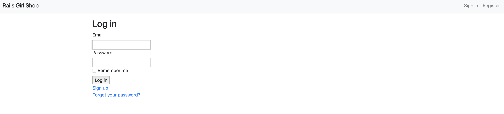

- You may raise another question. "Wait, so any signed in user can access the admin page?". Good question. We must differentiate a "normal user" and "admin user", who has power to edit the product.

- Run the following command to add a field `is_admin` to the User model

```bash
rails generate migration add_is_admin_to_users is_admin:boolean
```

- Run the following command to make the database schema change affective:

```bash
rake db:migrate
```

- Now register a new user with the email `admin@test.com`, and update the `is_admin` flag of that user in the Rails console:

```ruby
user = User.find_by(email: 'admin@test.com')
user.update(is_admin: true)
```

- Replace the admin link in `app/views/layouts/application.html.erb`:

```erb
<% if user_signed_in? %>
  <li class="nav-item">
    <a class="nav-link" href="<%= admin_root_path %>">Admin</a>
  </li>
<% end %>
```

With

```erb
<% if user_signed_in? && current_user.is_admin? %>
  <li class="nav-item">
    <a class="nav-link" href="<%= admin_root_path %>">Admin</a>
  </li>
<% end %>
```

- Update some contents in file `app/controllers/admin/products_controller.rb`:

+ Replace `before_action :authenticate_user!` by `before_action :authenticate_admin!`
+ Add those lines into the end of `ProductsController` class:

```ruby
def authenticate_admin!
  authenticate_user!
  unless current_user.is_admin?
    redirect_to root_path, alert: 'You must be admin to access this page'
  end
end
```

- That's it. Now you should test those scenarios to see how the authentication works

+ Access the page with `test@test.com`, you can view all the products page, but won't see the admin page on the top navigation bar.
+ Access the admin page directly [http://localhost:4000/admin](http://localhost:4000/admin) with `test@test.com`, you'll be redirected to the home page.
+ Access the page with `admin@test.com`, you can view all the products page and can use the admin page. The link to admin page is available on the top navigation bar.

- You can go extra miles by customize the styles of all the authentication pages in `app/views/devise`.

# 8. Shoping cart feature (Advanced)

One of the core functionalities of a shopping website is to let people shop and order items on your website. To achieve that purpose, most of the big e-commerce websites apply the concept of Shopping Cart. When viewing a product, a user can pick a product, put it into a virtual cart, and checkout later.

We'll use database to store the user's cart and items in the cart. The database schema looks like this:

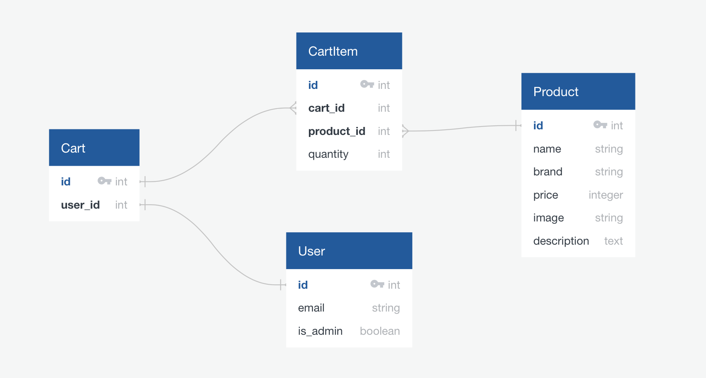

Each user has one unique cart at a time. Each cart includes a product reference (link to the Product tabel) and quantity of the product currently in cart.

- Run this command in the console to create Cart model:

```bash
rails g model Cart user:references
```

- Run this command in the console to create CartItem model

```bash
rails g model CartItem cart:reference product:references quantity:integer
```

- Run this command in the console to make the database schema affective

```bash
rake db:migrate
```

- Add validations and relations into the `Cart` model (`app/models/cart.rb`)

```ruby
class Cart < ApplicationRecord
  belongs_to :user
  has_many :cart_items
  validates :user_id, uniqueness: true

  def total_quantity
    cart_items.sum(:quantity)
  end

  def total_price
    cart_items.sum(&:sub_total_price)
  end
end
```

- Do the same with `CartItem` model (`app/models/cart_item.rb`)

```ruby
class CartItem < ApplicationRecord
  belongs_to :product
  belongs_to :cart

  validates :product_id, uniqueness: { scope: :cart_id }

  def sub_total_price
    product.price * quantity.to_i
  end
end
```

- Create `CartController` to handle the requests related to the cart

```bash
rails g controller Carts show --skip-routes
```

- Add the routing to the CartController in `config/routes.rb`:

```ruby
resource :carts, only: [:show] do
  post ':product_id', to: 'carts#add_item', as: :add_item
  delete ':product_id', to: 'carts#remove_item', as: :remove_item
end
```

- Let's add the cart badge into the navigation bar.

- Edit `app/controllers/application_controller.rb`

```ruby
class ApplicationController < ActionController::Base
  def current_cart
    if user_signed_in?
      Cart.find_or_create_by(
        user_id: current_user.id
      )
    end
  end
  helper_method :current_cart
end
```

- Add the current cart path into the navigation bar in `app/views/layouts/application.html.erb`

```erb
<% if current_cart %>
  <li class="nav-item">
    <div class="nav-link">
      <%= link_to carts_path do %>
        Cart (<%= current_cart.total_quantity %>)
      <% end %>
    </div>
  </li>
<% end %>
```

- Login and you can see something like `Cart (0)` on the top.


- Replace the content in `app/helpers/application_helper.rb` with

```ruby
def vietnamese_currency(price)
  number_to_currency(price, unit: 'đ', seperator: ',', format: "%n %u")
end
```

- Replace the content in `app/views/carts/show.html.erb` with

```erb
<h1 class="mt-3 mb-3">Shopping cart</h1>

<% if current_cart.total_quantity == 0 %>
  You have no items in the cart.
<% else %>
  <table class="table">
    <thead>
      <td></td>
      <td>Product</td>
      <td>Quantity</td>
      <td>Sub-total</td>
    </thead>
    <% current_cart.cart_items.each do |cart_item| %>
      <%= render 'cart_item', cart_item: cart_item %>
    <% end %>
    <tfoot>
      <td colspan="3"><b>Total</b></td>
      <td><%= vietnamese_currency(current_cart.total_price) %></td>
    </tfoot>
  </table>
<% end %>
```

- Create a new file `app/views/carts/_cart_item.html.erb` with the content:

```erb
<tr>
  <td class="align-middle">"/></td>
  <td class="align-middle">
    <div>
      <%= cart_item.product.brand %>
    </div>
    <div>
      <%= link_to cart_item.product.name, product_path(cart_item.product)%>
    </div>
    <div>
      <%= vietnamese_currency(cart_item.product.price) %>
    </div>
  </td>
  <td class="align-middle">
    <%= link_to "-", remove_item_carts_path(cart_item.product), method: :delete, class: 'btn btn-danger mr-3' %>
    <%= cart_item.quantity %>
    <%= link_to "+", add_item_carts_path(cart_item.product), method: :post, class: 'btn btn-success ml-3' %>
  </td>
  <td class="align-middle">
    <%= vietnamese_currency(cart_item.sub_total_price) %>
  </td>
</tr>
```

- Click on the `Cart(0)`, we'll see an empty shopping cart. We'll continue to implement "Add to cart" buttons.

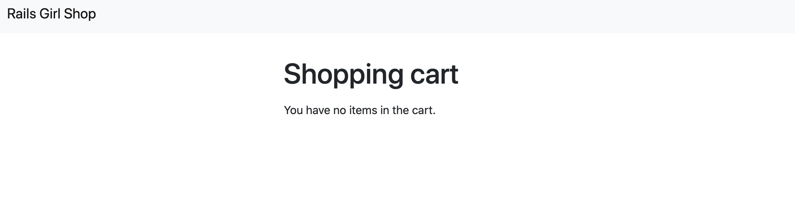

- Open `app/controllers/carts_controller.rb`.

+ Add into the top of `CartsController`

```ruby
before_action :authenticate_user!
before_action :set_product, only: [:add_item, :remove_item]
```

+ Add these three methods into `CartsController`

```erb
def add_item
  cart_item = current_cart.cart_items.find_or_create_by(
    product_id: @product.id
  )
  cart_item.update(quantity: cart_item.quantity.to_i + 1)

  redirect_to carts_path
end

def remove_item
  cart_item = current_cart.cart_items.find_by(
    product_id: @product.id
  )
  if cart_item.quantity.to_i > 1
    cart_item.update(quantity: cart_item.quantity.to_i - 1)
  else
    cart_item.destroy
  end

  redirect_to carts_path
end

private

def set_product
  @product = Product.find(params[:product_id])
end
```

- Add "Add to cart" button into desired location in `app/views/products/show.html.erb`:

```erb
<%= link_to "Add to cart", add_item_carts_path(@product), method: :post, class: 'btn btn-success mt-1' %>
```

- Do the same with `app/views/products/_product.html.erb`

- That's it. You can now test the feature, by clicking "Add to cart", and then edit the quantity with `-` and `+` buttons in the shopping cart. Enjoy!

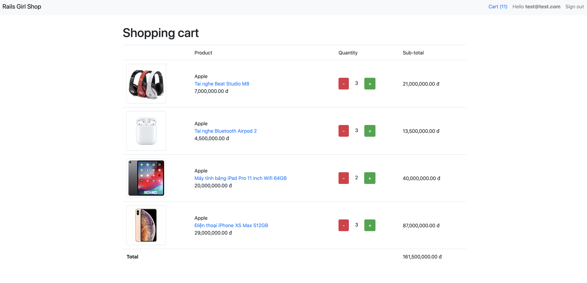
